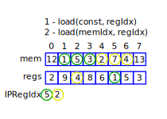
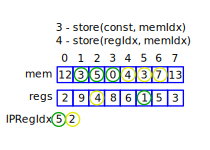
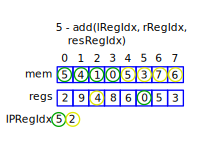
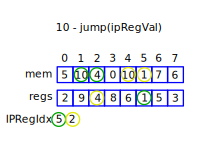
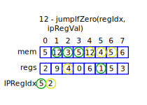

# Instruction Set

## "Load Constant" Instruction

Opcode: `0x1`.

Parameters:

- constant;
- register index.

Example:

## "Load Memory" Instruction

Opcode: `0x2`.

Parameters:

- memory index;
- register index.

Example:

## "Store Constant" Instruction

Opcode: `0x3`.

Parameters:

- constant;
- memory index.

Example:

## "Store Memory" Instruction

Opcode: `0x4`.

Parameters:

- register index;
- memory index.

Example:

## "Addition" Instruction

Opcode: `0x5`.

Parameters:

- left register index;
- right register index;
- result register index.

Example:

## "Subtraction" Instruction

Opcode: `0x6`.

Parameters:

- left register index;
- right register index;
- result register index.

Example (in a similar way):

## "Multiplication" Instruction

Opcode: `0x7`.

Parameters:

- left register index;
- right register index;
- result register index.

Example (in a similar way):

## "Division" Instruction

Opcode: `0x8`.

Parameters:

- left register index;
- right register index;
- result register index.

Example (in a similar way):

## "Modulo" Instruction

Opcode: `0x9`.

Parameters:

- left register index;
- right register index;
- result register index.

Example (in a similar way):

## "Jump" Instruction

Opcode: `0xa`.

Parameters:

- IP register value.

Example:

## "Jump If Negative" Instruction

Opcode: `0xb`.

Parameters:

- register index;
- IP register value.

Example (in a similar way):

## "Jump If Zero" Instruction

Opcode: `0xc`.

Parameters:

- register index;
- IP register value.

Example:

## "Jump If Positive" Instruction

Opcode: `0xd`.

Parameters:

- register index;
- IP register value.

Example (in a similar way):

